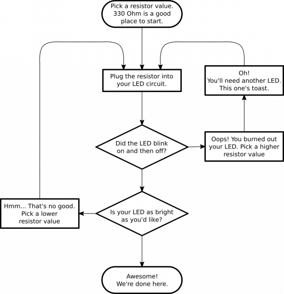

# traffic-signal

Learn how to mimic traffic lights with 3 LEDs.

For the arduino version, see [arduino readme](arduino/README.md).
For the raspberry pi version, see [raspberry pi readme](raspberrypi/README.md).

Both of the versions do the same thing, so you can also compare how these 2 programs differ.

## What you need

- 1x breadboard
- 3x LEDs: Red, Yellow, Green
- 3x 150 ohm resistors (see below why they are this size)
- 1x Arduino or Raspberry pi
- Jumper wires

## How to find which resistor you need

### Why do we even need a resistor?

LEDs are very sensitive to the current flowing through them, and can only tolerate up to a certain limit.
Most emit light when the current is between **1mA** and **20mA**. This current is called *forward current*.

In our case, we are also connecting these LEDs to our arduino or raspberry pi, and these can also tolerate output-current up to a certain limit.
If there is no load or very few between your pin and the ground, you essentially short circtuit the pin, so we want to avoid that.

These are then the 2 main reasons why we need a resistor:

- protect the LED by not exceeding the current it can tolerate
- protect the arduino or the pi against excessive output-current on its pins

### Without maths

Be prepared to kill your LED, this approach is based on observations.



### With maths

When connecting an LED as shown in the circuit image below, there will be a constant voltage across the LED.
This is called *forward voltage* (abbreviated Vf) and it varies with the LED colour as the colour.
It is generally safe to assume forward voltage is between **1.8V** and **2.2V**.

> IR have lower Vf, around 1.2-1.6V and UV have the highest, around 3.1-4.4V. 

- Rapsberry pi output pins deliver 3.3V and cannot tolerate more than 16mA per pin, with 51mA total ([ref](https://raspberrypi.stackexchange.com/a/8320))
- Arduino output digital pins deliver 5V and cannot tolerate more than 20mA per pin, with 100mA total ([ref1](https://www.arduino.cc/reference/en/language/functions/digital-io/digitalwrite/) - [ref2](https://playground.arduino.cc/Main/ArduinoPinCurrentLimitations))

Arduino:
- 20mA (arduino's max output current) as the LED's forward current
- 5V (arduino's pin output voltage) as the source voltage

Using ohm's law (U = R * i):
```
Vsource = 5V
Vled = 2.2V
Vresistor = Vsource - Vled = 2.8V
R = Vresistor / i = 2.8V / 20mA = 140ohm
```
[closest existing resistor value](https://en.wikipedia.org/wiki/E-series_of_preferred_numbers) = 150ohm

It's a simple Ohm's law, but there's even simpler: an online LED calculator: http://led.linear1.org/1led.wiz

Response: [150 ohms](http://led.linear1.org/1led.wiz?VS=5;VF=2.2;ID=20)

Raspberry pi:
- 16mA forward current
- 3.3V source voltage

Using ohm's law (U = R * i):
```
Vsource = 3.3V
Vled = 2.2V
Vresistor = Vsource - Vled = 1.1V
R = Vresistor / i = 1.1V / 16mA = 68.75ohm
```
[closest existing resistor value](https://en.wikipedia.org/wiki/E-series_of_preferred_numbers) = 82ohm

Response: [82 ohms](http://led.linear1.org/1led.wiz?VS=3.3;VF=2.2;ID=16)

## How to connect an LED

LEDs have a "long leg" and a shorter one and there is a good reason for it:
This is because current flows in one direction in LEDs, so you need to connect them accordinly.

The long leg is called anode, and is positive.

The short leg (or lead) is called cathode, and is negative.

> Tip: Longest is positive (more), sorter is negative (less).

Current always flows from positive to negative in a circuit, and same goes for the LED. 

> Read more on LEDS in [this sparkfun tutorial](https://learn.sparkfun.com/tutorials/light-emitting-diodes-leds)

Below is an example of a simple LED circuit.


## Resources and going further

Highly recommend reading [Make: Action](https://www.safaribooksonline.com/library/view/make-action/9781457187780/) where this example is taken from.

