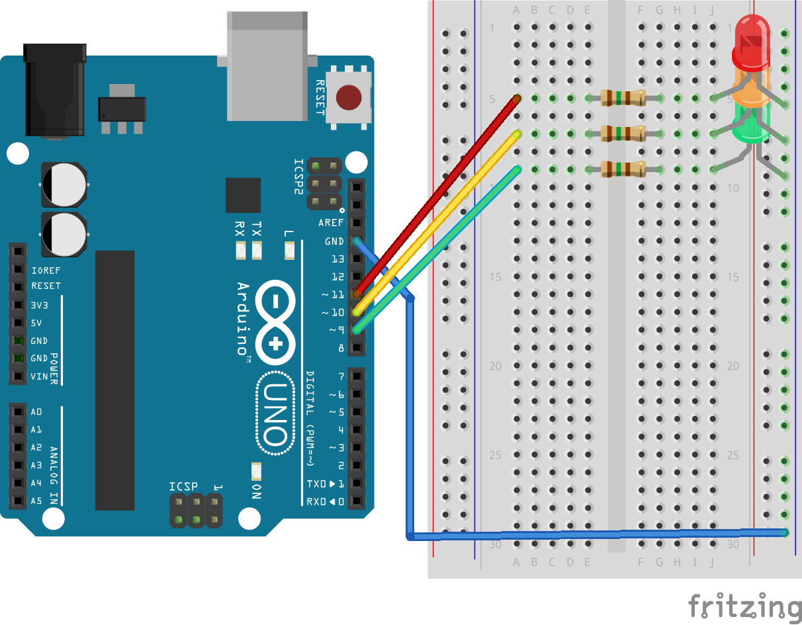

# Traffic signal - Arduino

## Circuit

> Before you start make sure you've read ["How to connect an LED"](../README.md#how-to-connect-an-led).

## Prerequisites

You will need to download [arduino IDE](https://www.arduino.cc/en/Main/Software) if you don't already have it.

After it's installed and plugged in your computer on a USB port, make sure you've:

- selected your board under Tools > Boards
- selected the processor under Tools > Processor
- selected the USB port under Tools > Port

## Code

Upload [traffic_signal.ino](traffic_signal/traffic_signal.ino) to the arduino using the arduino IDE.

LEDs will start their sequence once code is uploaded and will run until you unplug the device.
