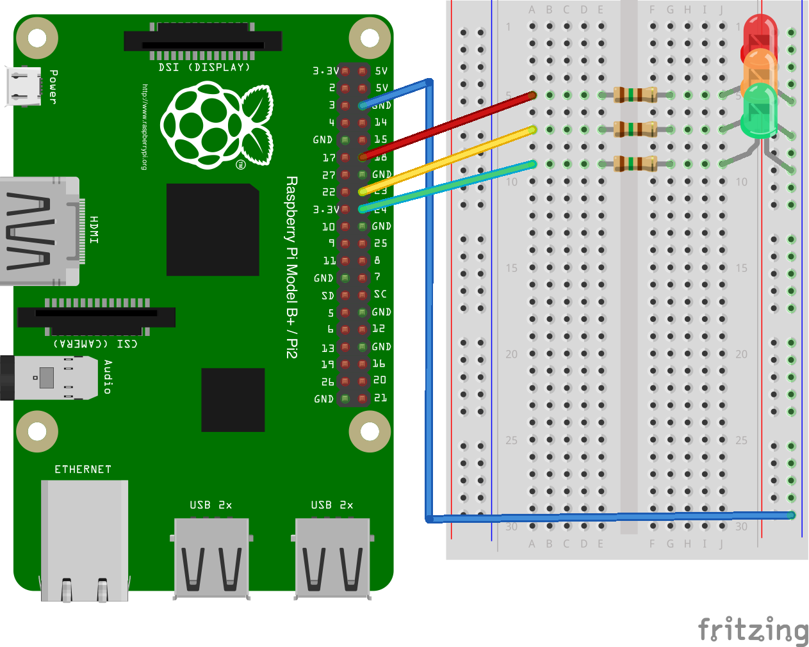

# Traffic signal - Raspberry pi

## Circuit

> Before you start make sure you've read "How to connect an LED" below.



## Prerequisites

You must be able to either SSH into the pi or have it connected with mouse and screen.

## Code

### Directly on the pi

If you're interacting with the pi directly, just place the code anywhere you want, and execute it.

### Over SSH

```console
$ scp raspberrypi/traffic_signal.py pi@raspberrypi.local:/tmp
$ ssh pi@raspberrypi.local
$ python /tmp/traffic_signal.py
```

> You can also deploy the code on the pi by cloning the git repository.
